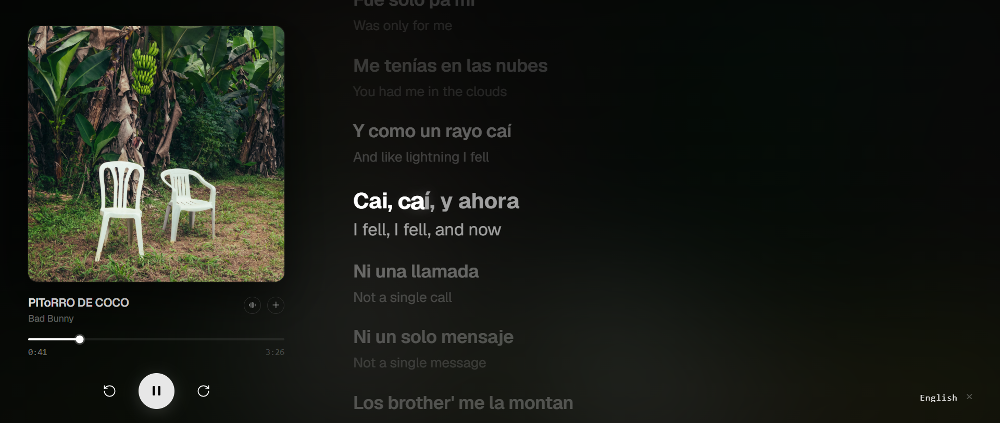

```markdown
# Lyrixsync



A web app for syncing lyrics to music.

## V1 (2023)
First version written in 2023, with HTML, CSS, and JavaScript.

Upload an audio file, then type or paste your lyrics and click **Set Lyrics**. This gives you a UI where you listen to the song and manually click each lyric line the moment it's sung — building the sync timestamps by hand.

## V2 (2026)
Second version written in 2026 with Next.js, TypeScript, and Tailwind CSS on the frontend, and Python on the backend.

Built with Next.js, TypeScript, and Tailwind CSS on the frontend, and Python on the backend.

Upload an audio file with the song name and artist in the filename. Lyrixsync will hit the iTunes API to fetch metadata like the track name, artist, and album cover, and will also attempt to automatically fetch lyrics.

From there you can sync the lyrics to the audio. The backend runs the audio through **Demucs** to separate it into vocal and instrumental stems, then uses **stable-ts** for word-level forced alignment — so each word is automatically synced exactly when it's sung.

---

## Setup for v2

### Frontend
Add a Gemini API key to enable translation:
```
NEXT_PUBLIC_GEMINI_API_KEY=your_key_here
```

### Backend
Python-based. Install dependencies and run the FastAPI server.